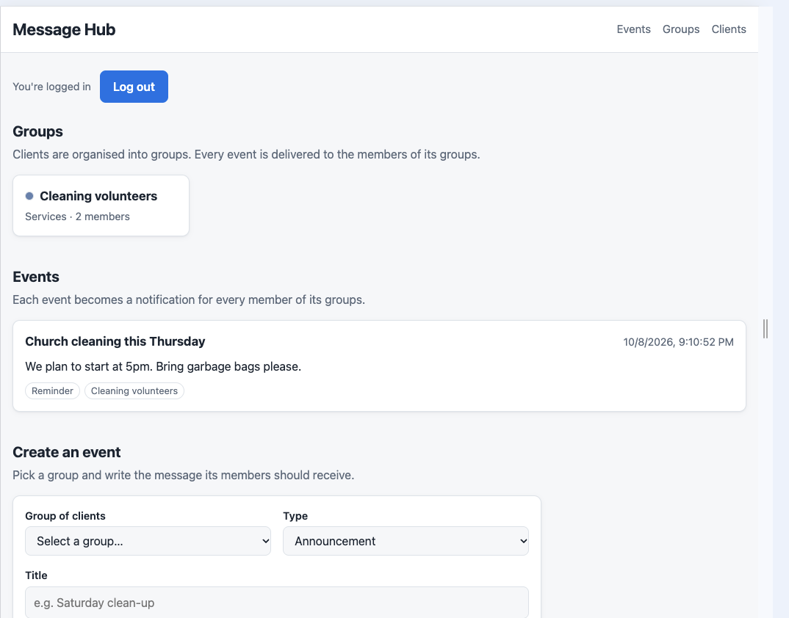

# Message Hub

## Tech stack

- **Backend:** C# / .NET 10, ASP.NET Core Web API (controllers)
- **Database:** Google Cloud Firestore (`Google.Cloud.Firestore`)
- **Authentication:** Firebase Authentication, with Firebase ID tokens validated as JWT bearer tokens in ASP.NET Core
- **Frontend:** HTML, CSS and React 18 loaded from a CDN, with JSX compiled in the browser by Babel. No build step; ASP.NET Core serves the pages as static files.

## About

Message Hub delivers messages to groups of people. You add **clients** (each with a name, email and phone), organise them into **groups**, and create **events**. Creating an event for a group creates a notification for every member of that group, to be delivered by email or SMS.

The backend is layered as controller → service → repository → Firestore, with DTOs mapping between the API and the stored models. Every API endpoint requires a signed-in user. The web pages let you log in, view and create events, build groups by picking clients, and add clients.

